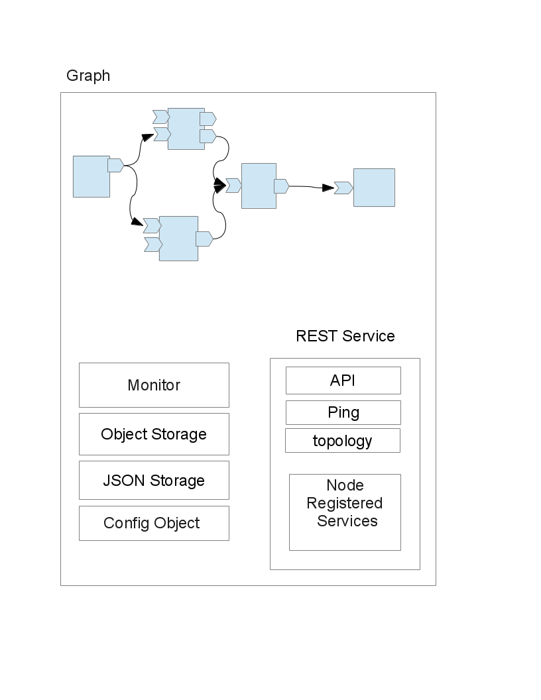
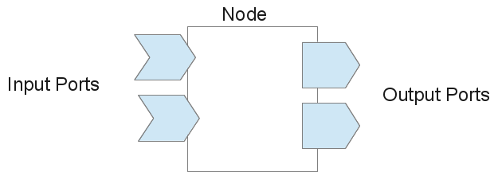

# QFlow
Qt library for flow based programming 

##Architecture:
main elements of QFlow are Graph, Node and Port

###Graph: 
graph is the base for a flow all nodes must be withing graph and provides some central services to nodes.

###Node:
Node is the main processing element and may have some ports.

###Port:
Port is used for connecting nodes to each other. Every port can be Input or Output. Every output port can be connected to one or multiple ports. All outputs to this port will be sent  to all connected ports.

###Flow Object:
Flow Object is used for flow entities that can be flown in network.

###Flow Object Storage: 
Flow Object Storage used for lifetime managemant of FlowObjects

The base packet is json based [QvariantMap in Qt] and contains this fields:
1. uuid: unique id for each packet
2. routing tag: an uuid generated on before sending to Output port.
3. Stacked tag: a list of routing tags stacked when request packet goes from node to node. And will be used for reverse flow of respond packet.

##Routing of flow packets:
a flow packet starts from a node sending to out port then routes to connected inport of another node and will be processed on new node. Receiver node can send it to another node or can reply to packet. If packet forwards to another node it will be processed on new node. In every node a flow packet can be replyed and it comes back to previous node.

##TODO List
1. complete documents
2. add graphical interface for monitoring
